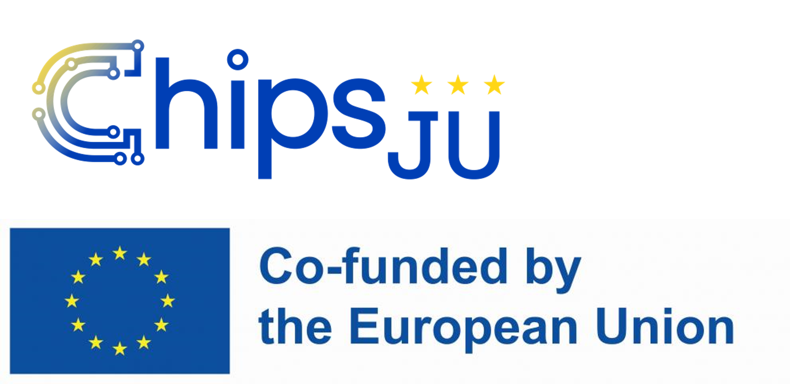

# JuliaPhase

**Julia packages for optical phase: retrieval, wavefront representation, interferometry and adaptive optics.**

Home of the **[Phase.jl](https://github.com/JuliaPhase/Phase.jl)** ecosystem: small, composable packages
that take you from a measured intensity or interferogram to a deformable-mirror command.

👉 Start at **[Phase.jl](https://github.com/JuliaPhase/Phase.jl)**: overview, joint documentation, citation.

| Area | Packages |
|---|---|
| Foundations | [SampledDomains.jl](https://github.com/JuliaPhase/SampledDomains.jl) · [PhaseUtils.jl](https://github.com/JuliaPhase/PhaseUtils.jl) · [PhaseBases.jl](https://github.com/JuliaPhase/PhaseBases.jl) |
| Algorithms | [AlternatingProjections.jl](https://github.com/JuliaPhase/AlternatingProjections.jl) · [PhaseRetrieval.jl](https://github.com/JuliaPhase/PhaseRetrieval.jl) · [PhaseFromInterferograms.jl](https://github.com/JuliaPhase/PhaseFromInterferograms.jl) · [CircleMedianFilter.jl](https://github.com/JuliaPhase/CircleMedianFilter.jl) |
| Adaptive optics | [DeformableMirrors.jl](https://github.com/JuliaPhase/DeformableMirrors.jl) · [MirrorCalibration.jl](https://github.com/JuliaPhase/MirrorCalibration.jl) |
| Geometry & plots | [EllipseGeometry.jl](https://github.com/JuliaPhase/EllipseGeometry.jl) · [PhasePlots.jl](https://github.com/JuliaPhase/PhasePlots.jl) |

Developed at [OKO Technologies](https://www.okotech.com) with support from the EU projects
[MADEin4](https://cordis.europa.eu/project/id/826589) (ECSEL JU, No 826589) and
[14AMI](https://doi.org/10.3030/101111948) (Chips JU, No 101111948).

  
  
  

  

  
  

Maintainer: [Oleg Soloviev](https://github.com/olejorik)
